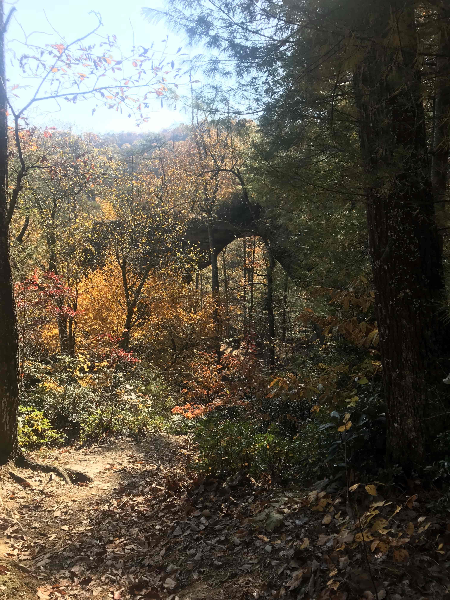
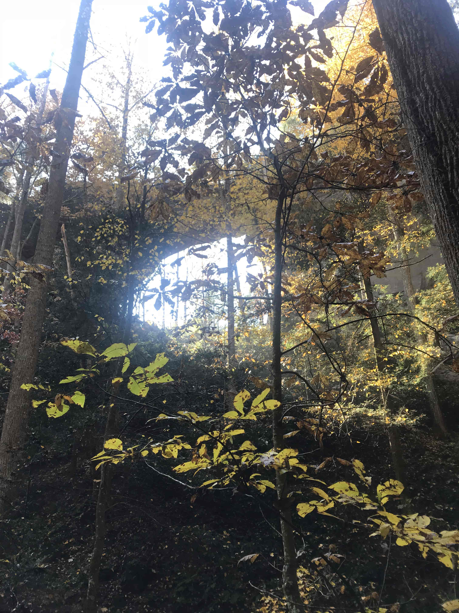
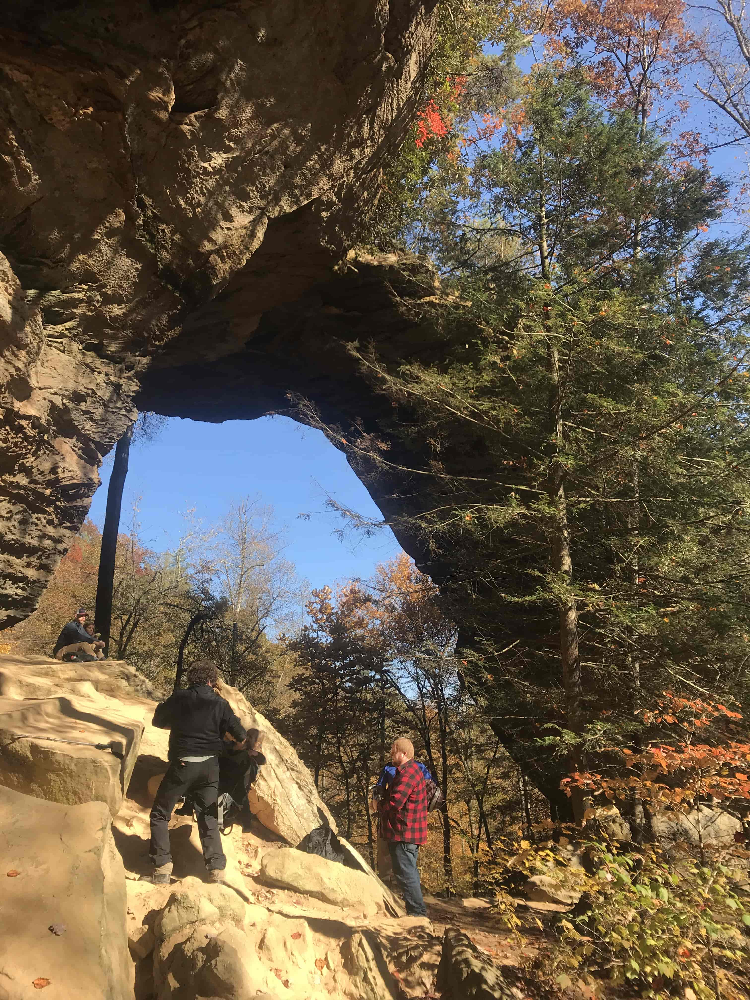
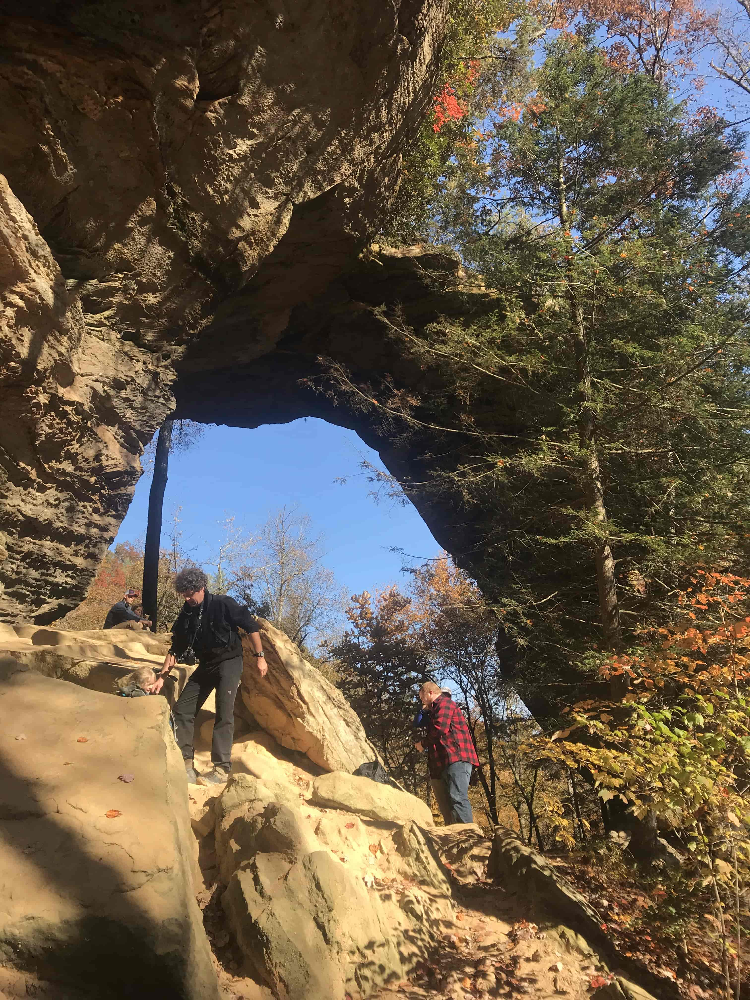
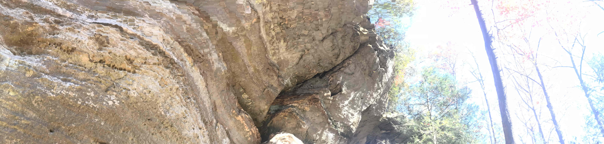
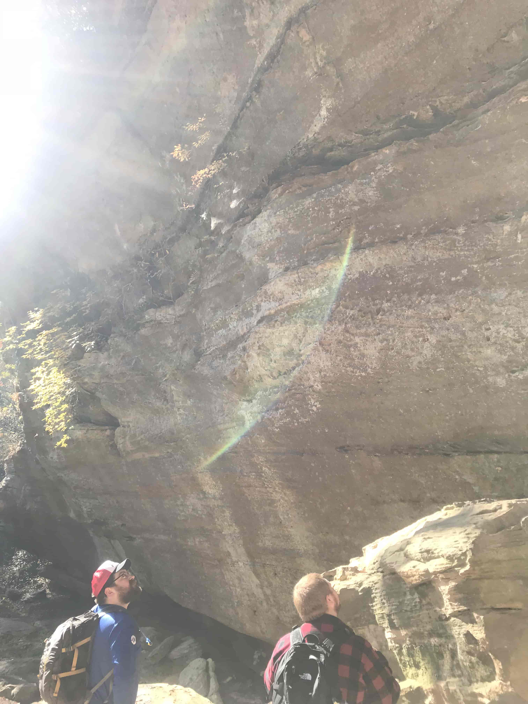
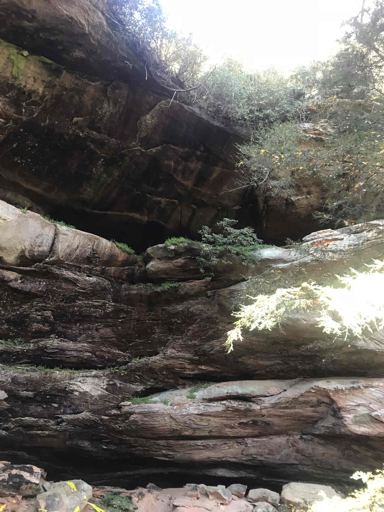

# Field Report: Miranda Spurgeon, Grays Arch, Photos taken Nov 3, 2018

The landform i selected is Grays Arch. it is a sloping arch from higher terrain, it gorgeous, like a piece of the hill has been chiseled out. I would say the peak opening of the arch is around 80 ft above the ground. The opening of the arch is large, you could park a school bus in the largest gap in the arch. There are larger boulders at the base where multiple people were sitting and admiring the scenery. 
The avenza map did well to stay in the general vicintiy of the arch but the arch location point on the map was a bit too far to the south. I reviewed my point on the old base map and the actual location of the arch was to the north. I personally think the map would be more useful 

Photographs 
Photo from higher up on the trail to the arch

Photo from the bottom portion of the trail to the arch

Photo from the opposing side of the arch. This really captures the height and scale of the arch.

